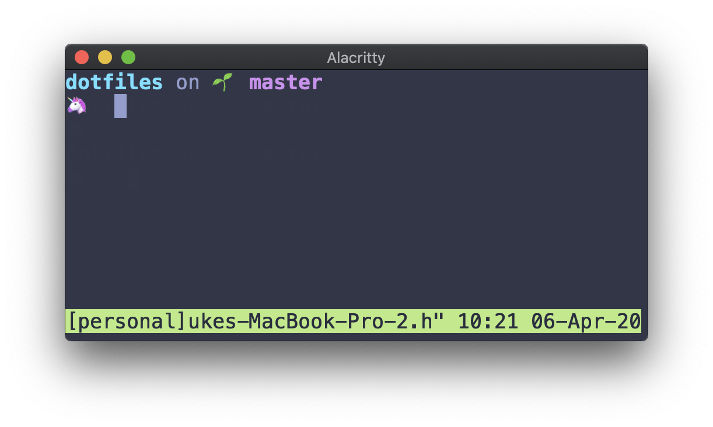

# Dotfiles

Dotfiles managed with [GNU stow](https://www.gnu.org/software/stow/) + [Homebrew Bundle](https://github.com/Homebrew/homebrew-bundle) + [VSCode Settings Sync](https://code.visualstudio.com/docs/editor/settings-sync)


## Installation

1. Sign in to App store manually (Temporary solution. See more: https://github.com/mas-cli/mas/issues/164)
2. Run install

```sh
curl -o - https://raw.githubusercontent.com/LukeSugiura/dotfiles/master/install | sh
```
