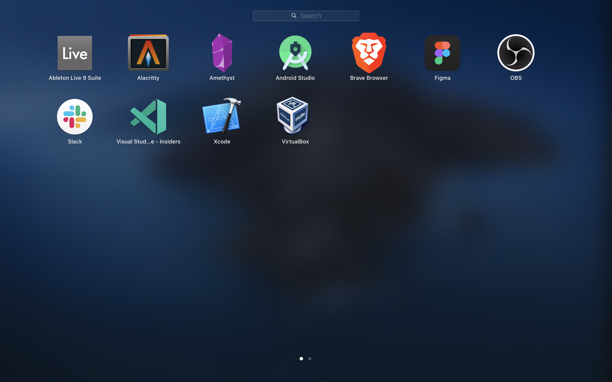

# Dotfiles

Dotfiles managed with [GNU stow](https://www.gnu.org/software/stow/) + [Homebrew Bundle](https://github.com/Homebrew/homebrew-bundle) + [VSCode Settings Sync](https://code.visualstudio.com/docs/editor/settings-sync)


## Installation

1. Sign in to App store manually (Temporary solution. See more: <https://github.com/mas-cli/mas/issues/164>)
2. Run install

```sh
curl -o - https://raw.githubusercontent.com/JunichiSugiura/dotfiles/master/install | sh
```

## Installed Apps

⚠️ Screenshot may not be up to date. Check [Brewfile](./Brewfile) for latest bundle.



## Tutorial
If you like to learn how to create dotfiles, check out my tutorial [here](https://github.com/JunichiSugiura/tutorials/tree/master/dotfiles).
